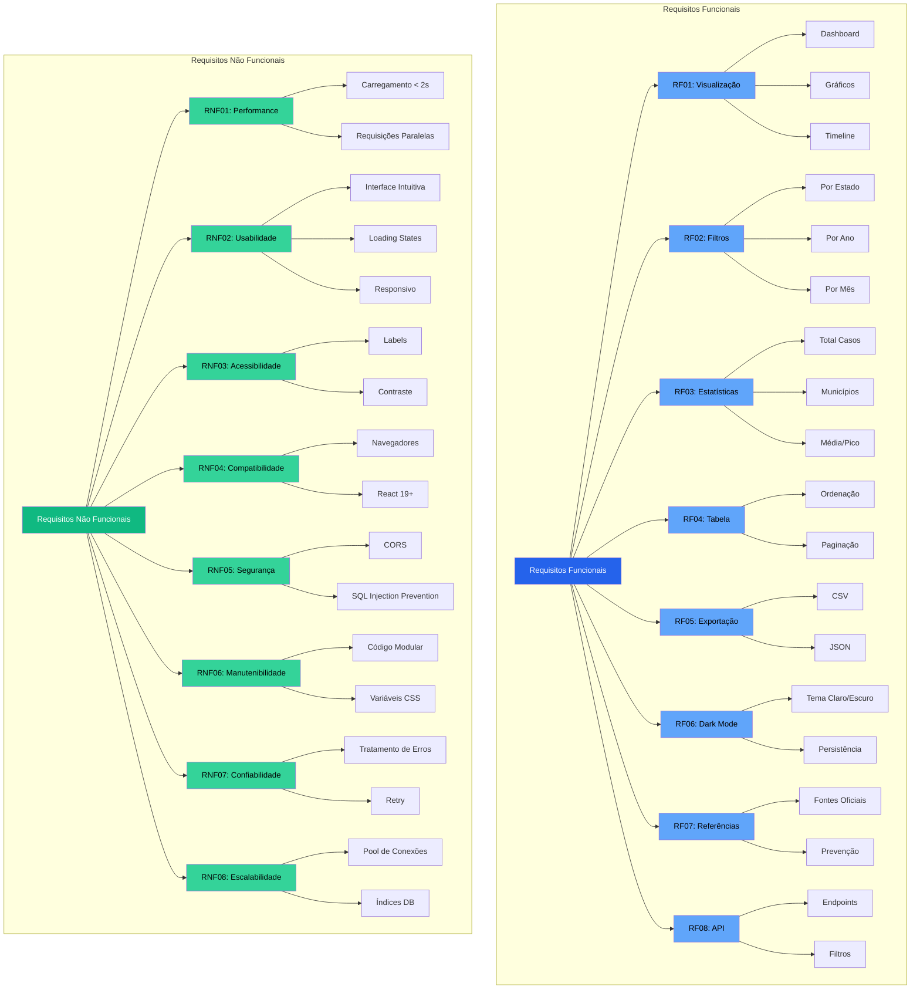

# Norovírus Brasil - Dashboard de Casos e Eventos

Dashboard interativo para visualização de casos de gastroenterite e eventos relacionados ao **Norovírus** no Brasil.  
Este projeto é uma aplicação de estudo que combina **Node.js, Express e PostgreSQL** para o backend, e **React com Vite** para o frontend.

---


## 🦠 Sobre o Norovírus

O **Norovírus** é um vírus altamente contagioso que causa gastroenterite aguda, afetando principalmente o sistema digestivo. É uma das principais causas de diarreia e vômitos em surtos comunitários, principalmente em ambientes fechados ou turísticos.

### Sintomas comuns

- Náuseas e vômitos
- Diarreia aquosa
- Dor abdominal
- Febre baixa
- Mal-estar geral
- Dores musculares

### Como se transmite

- Contato direto com pessoas infectadas
- Consumo de alimentos ou água contaminados
- Superfícies contaminadas

### Tratamento

- **Não existe medicamento específico** contra o Norovírus
- Hidratação é fundamental (água, soro oral)
- Repouso e alimentação leve
- Evitar a transmissão a outras pessoas com higiene rigorosa

### Sazonalidade

O vírus tem maior incidência **no verão**, principalmente em regiões turísticas com grande fluxo de visitantes, devido à proximidade e aglomerações em praias, hotéis e festas.

**Fontes de referência:**

- [CDC - Norovirus](https://www.cdc.gov/norovirus/index.html)  
- [OMS - Gastroenterite por Norovírus](https://www.who.int/news-room/fact-sheets/detail/norovirus)  
- [Ministério da Saúde - Vigilância Epidemiológica](https://www.gov.br/saude/pt-br)

---

## 🧰 Tecnologias usadas

### Backend
- Node.js v24  
- Express v5  
- PostgreSQL  
- CORS  
- dotenv  
- pg (PostgreSQL client)

### Frontend
- React 19.2.0
- Vite
- Axios
- Recharts (gráficos)
- React Hooks

### Ferramentas
- Git & GitHub

---

## 📋 Requisitos Funcionais

### RF01 - Visualização de Dados
- **RF01.1**: Sistema deve exibir dashboard com casos de norovírus por estado
- **RF01.2**: Sistema deve exibir gráfico de barras comparando casos por estado
- **RF01.3**: Sistema deve exibir gráfico de linha temporal mostrando evolução dos casos
- **RF01.4**: Sistema deve exibir gráfico de top 10 municípios com mais casos
- **RF01.5**: Sistema deve exibir timeline de surtos confirmados

### RF02 - Filtros e Consultas
- **RF02.1**: Sistema deve permitir filtrar casos por estado (SP, SC ou ambos)
- **RF02.2**: Sistema deve permitir filtrar casos por ano
- **RF02.3**: Sistema deve permitir filtrar casos por mês
- **RF02.4**: Sistema deve atualizar automaticamente todos os gráficos ao alterar filtros
- **RF02.5**: Sistema deve permitir combinação de múltiplos filtros simultaneamente

### RF03 - Estatísticas
- **RF03.1**: Sistema deve calcular e exibir total de casos registrados
- **RF03.2**: Sistema deve calcular e exibir número de municípios afetados
- **RF03.3**: Sistema deve calcular e exibir média de casos
- **RF03.4**: Sistema deve calcular e exibir pico de casos
- **RF03.5**: Sistema deve calcular e exibir taxa de crescimento (quando aplicável)

### RF04 - Tabela de Dados
- **RF04.1**: Sistema deve exibir tabela detalhada com todos os casos
- **RF04.2**: Sistema deve permitir ordenação por qualquer coluna (município, estado, ano, mês, casos)
- **RF04.3**: Sistema deve implementar paginação (10 registros por página)
- **RF04.4**: Sistema deve exibir indicadores visuais de ordenação (setas)

### RF05 - Exportação de Dados
- **RF05.1**: Sistema deve permitir exportar dados filtrados em formato CSV
- **RF05.2**: Sistema deve permitir exportar dados filtrados em formato JSON
- **RF05.3**: Sistema deve exportar apenas os dados visíveis após aplicação dos filtros

### RF06 - Modo Escuro
- **RF06.1**: Sistema deve permitir alternar entre modo claro e escuro
- **RF06.2**: Sistema deve salvar preferência do tema no localStorage
- **RF06.3**: Sistema deve aplicar cores adequadas aos gráficos em ambos os modos
- **RF06.4**: Sistema deve respeitar preferência do sistema na primeira visita

### RF07 - Referências e Informações
- **RF07.1**: Sistema deve exibir seção com fontes oficiais do governo
- **RF07.2**: Sistema deve exibir links para institutos de pesquisa
- **RF07.3**: Sistema deve exibir informações sobre prevenção do norovírus
- **RF07.4**: Sistema deve exibir avisos sobre uso médico das informações

### RF08 - API Backend
- **RF08.1**: API deve fornecer endpoint para listar casos com filtros
- **RF08.2**: API deve fornecer endpoint para estatísticas agregadas
- **RF08.3**: API deve fornecer endpoint para dados temporais (timeline)
- **RF08.4**: API deve fornecer endpoint para top municípios
- **RF08.5**: API deve fornecer endpoint para listar eventos/surtos

---

## 🔧 Requisitos Não Funcionais

### RNF01 - Performance
- **RNF01.1**: Sistema deve carregar dados em menos de 2 segundos
- **RNF01.2**: Sistema deve usar requisições paralelas (Promise.all) para otimizar carregamento
- **RNF01.3**: Sistema deve implementar paginação para grandes volumes de dados
- **RNF01.4**: Sistema deve otimizar renderização de gráficos com ResponsiveContainer

### RNF02 - Usabilidade
- **RNF02.1**: Interface deve ser intuitiva e fácil de navegar
- **RNF02.2**: Sistema deve exibir loading spinner durante carregamento
- **RNF02.3**: Sistema deve exibir mensagens de erro amigáveis
- **RNF02.4**: Sistema deve ser responsivo (mobile, tablet, desktop)
- **RNF02.5**: Sistema deve ter transições suaves entre estados

### RNF03 - Acessibilidade
- **RNF03.1**: Sistema deve usar labels adequados em formulários
- **RNF03.2**: Sistema deve ter contraste adequado em ambos os temas
- **RNF03.3**: Sistema deve ser navegável via teclado
- **RNF03.4**: Sistema deve ter aria-labels em elementos interativos

### RNF04 - Compatibilidade
- **RNF04.1**: Sistema deve funcionar em navegadores modernos (Chrome, Firefox, Edge, Safari)
- **RNF04.2**: Sistema deve ser compatível com React 19+
- **RNF04.3**: Sistema deve usar PostgreSQL como banco de dados

### RNF05 - Segurança
- **RNF05.1**: Sistema deve usar CORS configurado adequadamente
- **RNF05.2**: Sistema deve validar parâmetros de entrada na API
- **RNF05.3**: Sistema deve usar prepared statements (SQL injection prevention)
- **RNF05.4**: Sistema não deve expor credenciais de banco de dados no código

### RNF06 - Manutenibilidade
- **RNF06.1**: Código deve ser modular e componentizado
- **RNF06.2**: Sistema deve usar variáveis CSS para facilitar manutenção de temas
- **RNF06.3**: Sistema deve ter separação clara entre frontend e backend
- **RNF06.4**: Sistema deve seguir padrões de código (ESLint)

### RNF07 - Confiabilidade
- **RNF07.1**: Sistema deve tratar erros de conexão com backend
- **RNF07.2**: Sistema deve permitir retry em caso de falha
- **RNF07.3**: Sistema deve validar dados antes de exibir
- **RNF07.4**: Sistema deve funcionar mesmo com dados incompletos

### RNF08 - Escalabilidade
- **RNF08.1**: API deve suportar múltiplas requisições simultâneas
- **RNF08.2**: Sistema deve usar pool de conexões PostgreSQL
- **RNF08.3**: Queries devem ser otimizadas com índices apropriados

---

## 📊 Diagrama de Requisitos



### Arquitetura do Sistema

```mermaid
graph LR
    subgraph "Frontend - React"
        UI[Interface do Usuário]
        UI --> Filters[Filtros]
        UI --> Charts[Gráficos]
        UI --> Table[Tabela]
        UI --> Export[Exportação]
        UI --> Theme[Dark Mode]
    end
    
    subgraph "Backend - Node.js/Express"
        API[API REST]
        API --> Routes[Rotas]
        Routes --> Cases[/casos]
        Routes --> Stats[/casos/stats]
        Routes --> Timeline[/casos/timeline]
        Routes --> Top[/casos/top-municipios]
        Routes --> Events[/eventos]
    end
    
    subgraph "Banco de Dados"
        DB[(PostgreSQL)]
        DB --> CasesTable[casos_gastro]
        DB --> EventsTable[eventos_surtos]
    end
    
    UI -->|HTTP Requests| API
    API -->|Queries SQL| DB
    DB -->|Dados| API
    API -->|JSON| UI
    
    style UI fill:#2563eb,color:#fff
    style API fill:#10b981,color:#fff
    style DB fill:#f59e0b,color:#fff
```

---